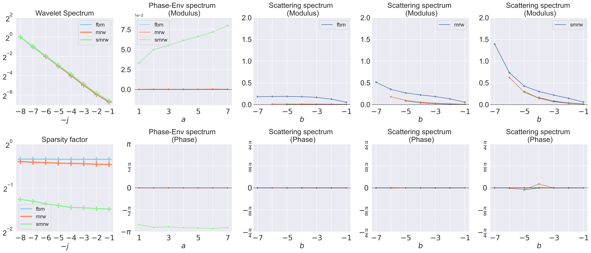
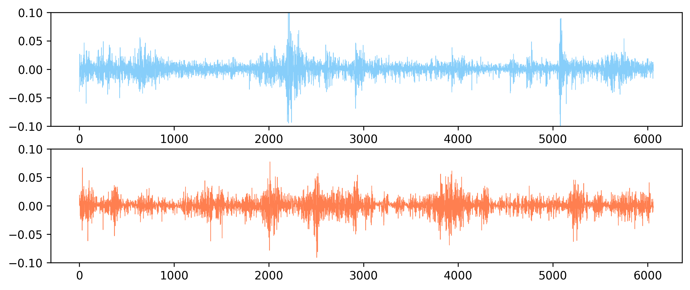

# Scattering covariance

This repository implements the *Scattering Covariance* introduced in [1].

It provides an interpretable low-dimensional representation of multi-scale time-series.

The main application of *Scattering Covariance* is time-series **analysis** and time-series **generation**.

Among other applications are the assessment of **self-similarity** in the data and the detection of **non-Gaussianity**.

## Installation

Run the commands below to install the required packages.

```bash
pip install git+https://github.com/RudyMorel/scattering_covariance
```

## Analysis

The *Scattering Covariance* provides a dashboard used to analyze multi-scale time-series.

Standard model of time series can be loaded using **load_data** from `frontend.py`. The function **analyze** computes *Scattering Covariance*, it can be visualized using the function **plot_dashboard**.

```python
from scatcov.frontend.functions import (analyze, generate, load_data,
                                        plot_dashboard)

# DATA
X = load_data(process_name='fbm', B=128, T=8192, H=0.5)  # a B x T array

# ANALYSIS
RX = analyze(X, J=8, high_freq=0.25)  # a DescribedTensor

# VISUALIZATION
plot_dashboard(RX)
```

It can be used to quantify non-Gaussianity and discriminate models such as fBm, MRW, SMRW:

```python
# DATA
X1 = load_data(process_name='fbm', B=256, T=32768)
X2 = load_data(process_name='mrw', B=256, T=32768, lam=0.1)
X3 = load_data(process_name='smrw', B=256, T=32768, lam=0.1,
               gamma=1/32768/256, K=0.07, alpha=0.23, beta=0.23)

# ANALYSIS
RX1 = analyze(X1, J=8, high_freq=0.25, cuda=True, nchunks=64)
RX2 = analyze(X2, J=8, high_freq=0.25, cuda=True, nchunks=64)
RX3 = analyze(X3, J=8, high_freq=0.25, cuda=True, nchunks=64)

# VISUALIZATION
plot_dashboard([RX1, RX2, RX3], labels=['fbm', 'mrw', 'smrw'])
```



## Generation

A model of the process $X$ can be defined from the *Scattering Covariance*. Such model can be sampled using gradient descent [1].

Function **generate** from `frontend.py` takes observed data $X$ as input and return realizations of our model of $X$.

```python
# DATA
X = load_data(process_name='smrw', B=1, T=4096, lam=0.1,
              gamma=1/4096/256, K=0.03, alpha=0.23, beta=0.23)

# GENERATION
X_gen = generate(X, J=9, S=1, it=10000, cuda=True, tol_optim=5e-4)

# VISUALIZATION
fig, axes = plt.subplots(2,1, figsize=(10,5))
axes[0].plot(np.diff(X)[0,:], color='lightskyblue', linewidth=0.5)
axes[1].plot(np.diff(X_gen)[0,:], color='coral', linewidth=0.5)
```



[1] "Scale Dependencies and Self-Similarity Through Wavelet Scattering Covariance"

Rudy Morel et al. - https://arxiv.org/abs/2204.10177
